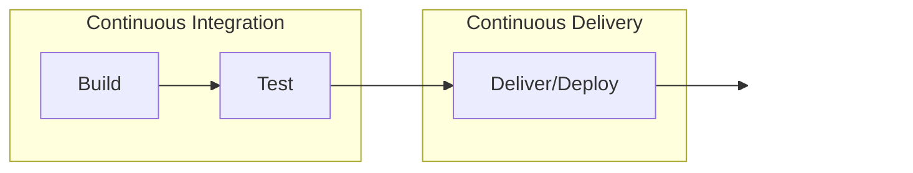

# Ansys SCADE CICD example

In this project, we are going to look at how to implement the prevalent ``CI/CD`` (Continuous Integration / Continuous Delivery) practice on software developed with SCADE Suite.
This example uses SCADE CICD scripts available [here](https://github.com/Ansys-Scade/scade-cicd).

We will start by exploring the concepts of CI/CD. We will then have a look at what software and services are typically used to set it up. Finally, we will showcase a concrete working example of CI/CD with SCADE, complete with a Git repository you can play with.

## What is CI/CD?

Continuous Integration (CI) / Continuous Delivery or Deployment (CD) is a method to deliver software changes frequently and reliably.

### Continuous Integration

Continuous Integration was born from a simple observation: when collaborating on a complex piece of software, it is easier to often review small, incremental changes than it is to wait and check in large changes.

Since reviewing changes and integrating them is still a lot of work, the process relies on heavy automation to make things as smooth as possible.

When software developers collaborate around a Version Control system (such as Git), the Continuous Integration system will pick up any new changes, build the complete software and run automated tests on it, raising alerts in case of failures. The specifics of building and testing depend on the project’s tech stack.

### Continuous Delivery

By design, Continuous Integration regularly produces a piece of working software. The next logical step is to do something with it! Enter Continuous Delivery.

Packaging a build and distributing it is a repetitive process that lends itself well to automation. Continuous Delivery heavily relies on scripted actions to accomplish this, freeing engineers to work on higher-level tasks.

When Continuous Integration successfully produces a build, Continuous Delivery picks it up and performs specialized tasks to package and distribute it. For instance, if the software is an online service, it may be deployed onto a server so that users can benefit from the changes. 

### Pipeline
A specific project’s CI/CD configuration is called a CI/CD pipeline. It is composed of large blocks (e.g. “build”), each containing inner steps (e.g. “compile this sub-system into a DLL and move on to the next step).

At a high level, a CI/CD pipeline looks like this:

Pipelines are often triggered automatically by predefined events: a code check-in, a pull/merge request, or other changes in the Version Control system. Due to the extensive automation, this commit / build / test / deploy process becomes continuous - hence the “C”s in “CI/CD”.

### Benefits

Thanks to a CI/CD approach:
- Teams have an incentive to focus on creating small, incremental changes, and be assured that the overall software continues working.
- Relying on extensive automated testing is encouraged. Adding tests with each new increment of the software, or when repairing regressions, ensures that the pipeline will be more effective at producing quality output.
- The CI system often produces working builds of the whole software, re-running all tests and ensuring issues are detected early.
- The CD system automates repetitive packaging and delivery tasks, freeing up the team to work on higher-level tasks.

## SCADE Suite and CI/CD

`SCADE Suite` is a model-based software development environment. While engineers work on models instead of writing code, the principles of software development still apply, including a CI/CD approach.

When engineers collaborate on a SCADE model to produce safe embedded software, they can use a Version Control system (such as Git) to track changes, just as they would if they were collaborating on manual code.

Typical lifecycle activities for a SCADE Suite model are:
- Check a model for correct semantic and design rules
- Build a diff report for new changes
- Report the model design documentation
- Execute a functional test suite
- Acquire model coverage
- Generate code from the model
- Deliver application binaries downstream (e.g. onto a download repository, a test bench…)

All the above activities can be automated inside of a CI/CD pipeline. The preferred way to automate these tasks is through a Windows batch file that runs SCADE in command line mode with the proper arguments, displays the results and returns a success or error code.

## Practical examples

Many tools for SW development and automation provide a support for a CI/CD workflow. This example presents a default integration with three of them.
But it is possible to use any other tools re-using scripts implementing each steps of a SCADE activity.

### GitHub

GitHub provides an automation framework called [GitHub Actions](https://docs.github.com/en/actions), which can support CI/CD pipelines.

GitHub relies on a [Runner](https://docs.github.com/en/actions/hosting-your-own-runners/about-self-hosted-runners) concept: a piece of software, running on a machine, which picks up CI/CD jobs as they are triggered. Runners may be hosted by GitHub (for a fee), or self-hosted by installing them on machines you own. Should you use self-hosted runners, you may [configure](https://docs.github.com/en/actions/hosting-your-own-runners/adding-self-hosted-runners) them from your repository’s settings.

GitHub _runners_ execute CI/CD pipelines called _workflows_. They are triggered by _events_ and contain _jobs_, which are made of _steps_.

The whole CI/CD configuration is described in YAML files, stored by convention inside the \ `.github/workflows` directory. The file’s structure is documented in more detail [here](https://docs.github.com/en/actions/using-workflows/about-workflows).

### GitLab

GitLab relies on a [Runner](https://docs.gitlab.com/runner/) concept (similar to GitHub’s). Runners are available for both GitLab SaaS and self-managed GitLab installation. Should you use self-hosted runners, you may [register them](https://docs.gitlab.com/runner/) and later refer to them by name or tag when running run jobs.

GitLab _runners_ execute CI/CD _pipelines_. They are triggered by _events_ and contain _stages_, which are made of _jobs_.

The whole CI/CD configuration is described in a YAML file, called by convention `.gitlab-ci.yml`, stored at the root of the repository. The file’s structure is documented in more detail [here](https://docs.gitlab.com/ee/ci/yaml/gitlab_ci_yaml.html).

### Jenkins

Jenkins is a self-hosted automation server that runs on a master machine you own. Jenkins provides a web interface to configure and manage the service.
All jobs are executed by Jenkins agents, installed on machines you own.

Jenkins _agents_ execute CI/CD _pipelines_. They are triggered by _triggers_ and contain _stages_, which are made of _steps_.

The whole CI/CD configuration is described in a text file, called by convention `Jenkinsfile`, stored at the root of the repository. The file’s structure is documented in more detail [here](https://www.jenkins.io/doc/book/pipeline/jenkinsfile/).

## Let’s do this!

In this Git repository, you will find:
- The Cruise Control SCADE model (as seen in the software’s out-of-the-box examples)
- Pre-made batch scripts to launch various activities using SCADE in command line mode
- Ready-to-use CI/CD configurations for GitHub, GitLab and Jenkins

Are you ready to try this out? Then go clone the repo, upload it in your Version Control system of choice and play with it!

## License and acknowledgments

This project is licensed under the [MIT license](https://github.com/Ansys-Scade/scade-cicd-example/blob/main/LICENSE).

It makes no commercial claim over Ansys whatsoever. It extends the functionality of Ansys SCADE by adding scripts without changing the core behavior or license of the original software. The use of this project requires a legally licensed local copy of SCADE tools.

For more information on SCADE visit [Ansys Embedded SW](https://www.ansys.com/products/embedded-software).
